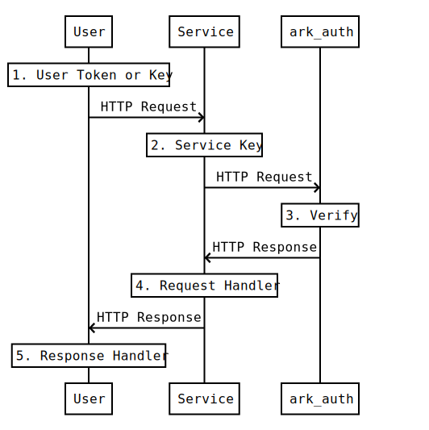

# Integration

The following diagram illustrates how services and Ark Auth integrate to authenticate user requests.



1. User with token or key acquired by authentication method sends HTTP request to service.
2. Service sends HTTP request to Ark Auth with its own service key, and the users token or key.
3. Ark Auth authenticates service using the service key, and verifies user token or key.
4. If authenticated/verified, service handles request and sends HTTP response to user.
5. User handles HTTP response.

## Callbacks

A service integrating with Ark Auth can provide the following HTTPS endpoints as callbacks.

```shell
GET $service_url?access_token=$token&refresh_token=$token
```

User is redirected to this URL after successful authentication by an OAuth2 provider. The service can verify the `access_token` query parameter to authenticate the user and their requests.

```shell
GET $service_url?email=$email&reset_password_token=$token
```

User requests this URL by clicking reset password email link. The service can take password input from the user, and then make a reset password confirm request with the `reset_password_token` query parameter.

```shell
GET $service_url?email=$email&old_email=$email&update_email_token=$token
```

User requests this URL by clicking update email revoke link. The service can present the user information on securing their account, and then make an update email revoke request with the `update_email_token` query parameter. This will disable the user and all user keys.

```shell
GET $service_url?email=$email&update_password_token=$token
```

User requests this URL by clicking update password revoke link. The service can present the user information on securing their account, and then make an update password revoke request with the `update_password_token` query parameter. This will disable the user and all user keys.
